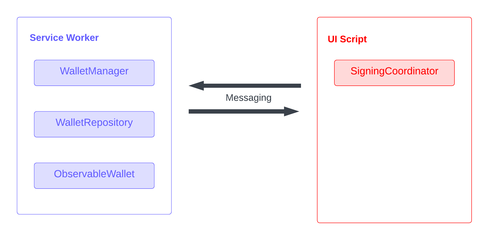
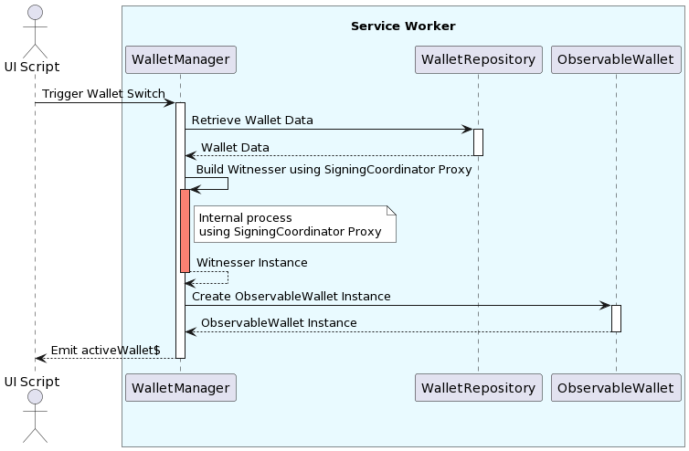
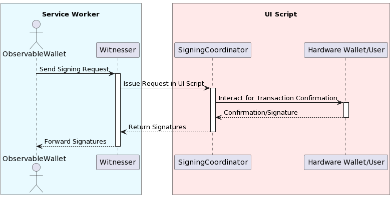
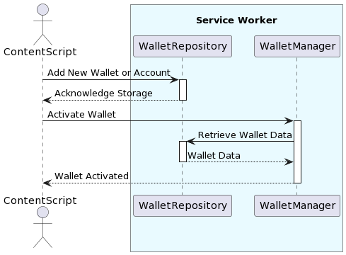
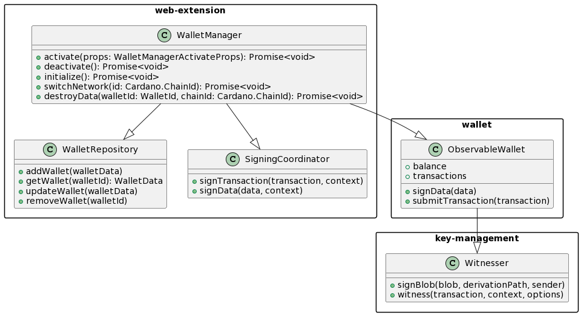
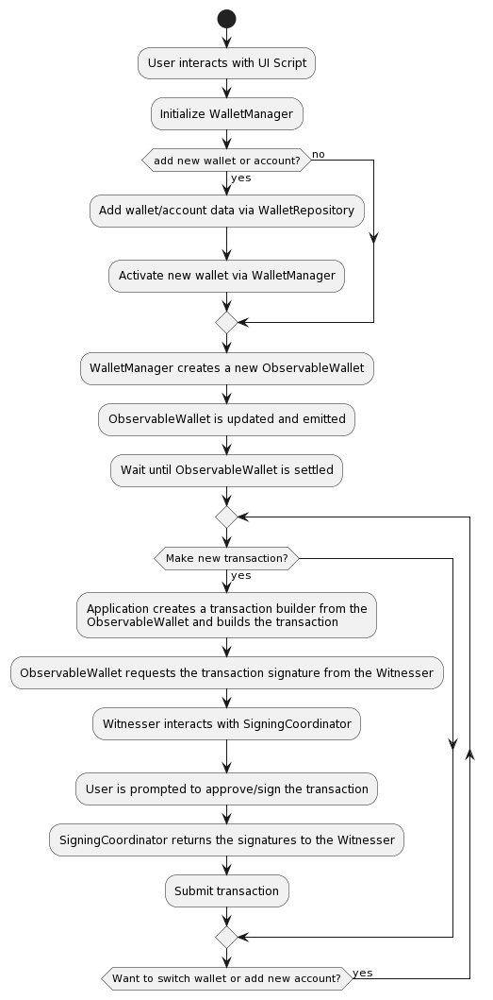

# Cardano JS SDK | web-extension

## About the Package Name

**Web-extension** can refer to a “browser extension” or the Web-Extensions browser API; it was chosen because the package is coupled to this API.

## Introduction

This document describes the utilization of the **web-extension** package in the construction of browser-based cryptocurrency wallets, detailing its architecture, components, and their interactions.

In this document, we will cover:

- **System Overview:** Providing a high-level perspective of the web-extension package and its role in wallet development.

- **Component Descriptions:** Delving into the details of the components within the web-extension package, including relevant components sourced from other packages within this SDK.

- **Diagrams:** Discussing how these components interact within the context of a web browser extension with visual representations to aid in understanding the structure and flow of interactions.

## System Overview

The **web-extension** package provides components for handling wallet management-related operations within the browser web extensions context. It brings together its own specialized components and further leverages additional elements from other SDK packages, notably the **ObservableWallet** interface from the 'wallet' package and the **Witnesser** interface from the 'key-management’ package.

### Components from the web-extension Package

- **WalletManager:** Manages the lifecycle of ObservableWallets, including activation and deactivation, and is responsible for creating Witnesser instances.

- **WalletRepository:** Handles the storage, retrieval, and management of wallet data within the extension environment.

- **SigningCoordinator:** Facilitates transaction and data signing.

### Components from the 'wallet' Package

- **ObservableWallet Interface:** A comprehensive wallet management solution handling transactions, address management, balance tracking, and other wallet operations. Provides real-time observability of the wallet's state, essential for responsive user interfaces.

### Component from the 'key-management' Package

- **Witnesser Interface:** This Interface is an abstraction designed to decouple ObservableWallet implementations from the KeyAgent, facilitating transaction signing. This interface connects the SigningCoordinator with wallet functionalities and paves the way for implementing multi-signature and shared wallets.

### Component Locations: Service Worker and UI Script

Within the web extension environment, components are strategically distributed across the service worker, UI and content script. The **WalletManager**, **WalletRepository**, and **ObservableWallet** instances reside in the service worker, while the **SigningCoordinator** is located in the UI script.

The **WalletManager**, **WalletRepository**, and **ObservableWallet** instances are located in the service worker for performance, consistency, and security reasons; this also enables wallet connectivity via CIP-30 without the need for the wallet UI to remain open. This setup ensures a responsive user experience, as the service worker handles intensive tasks independently of the UI script, preventing any blocking. Additionally, browser wallets which feature both popup and full-screen UIs operating simultaneously, having these components in a single service worker provides a unified source of truth, ensuring consistency and synchronization between these different user interfaces.

The **WalletManager** utilizes the **SigningCoordinator** (exposed from the UI script to the service worker) to create **Witnesser** instances, which are then provided to **ObservableWallets** upon their creation. Communication between the **Witnesser** in the service worker and the **SigningCoordinator** in the ui script is facilitated by the web extension's messaging system.

Placing the **SigningCoordinator** in the UI script is required for hardware wallet interactions and user confirmations (device connection must be initiated via user gesture, as per default browsers security policy), allowing direct handling of sensitive operations like password entry and secret access.

In-memory key agents could technically live in the service worker, but keeping them in UI context makes the design simpler (same for all types of wallets). It also has a security advantage when signing: it should reduce the amount of time that passphrase, which is sensitive data, is kept in-memory, as it doesn’t have to be passed to a different javascript context, as well as reduces attack surface as it doesn’t have to go through extension messaging API.

This arrangement also ensures a safer, isolated environment for user prompts and transaction confirmations. As thus, the components of the wallet-extension are distributed among the service worker and the UI script as follows:



## Component Descriptions

### SigningCoordinator

The **SigningCoordinator** component operates within the UI script of the web extension, which is a strategic choice to leverage direct user interaction capabilities, especially important for operations involving hardware wallets.

In essence, the **SigningCoordinator** is responsible for managing the signing of transactions and data. It is designed to handle various types of signing requests, including transaction witness requests and data signing requests. For instance, when a transaction needs to be signed, the **SigningCoordinator** takes the transaction details along with the context and options provided and processes them to generate the necessary signatures. This process may involve interactions with hardware wallets or user inputs, which are handled within the UI script environment.

The **SigningCoordinator** also offers flexibility in handling different wallet types, such as InMemory, Ledger, and Trezor wallets. This flexibility is crucial for a web extension that aims to support a wide range of user preferences and hardware capabilities.

### WalletManager

The **WalletManager** is responsible for orchestrating various wallet-related operations. It handles the lifecycle of wallets, including their creation, initialization, activation, deactivation, and switching of networks. These wallets are **ObservableWallet** instances, these instances provide real-time updates and states of the wallets, which include balance tracking, transaction histories, and more. The **WalletManager** effectively maintains a record of these instances, ensuring that the wallets are readily accessible.

Another significant aspect of the **WalletManager** is its interaction with the **SigningCoordinator** via the creation of **Witnesser** instances. The **WalletManager** leverages the **SigningCoordinator**, which resides in the UI script, to facilitate the signing processes. It provides the necessary **Witnesser** instances to the **ObservableWallets**, enabling them to perform cryptographic operations like transaction signing.

The **Witnesser** abstracts the validation of UTXO expenditures by managing various types of witnesses. For standard UTXOs, it generates cryptographic signatures. When dealing with script-controlled UTXOs, it supplies the necessary scripts and any additional components, such as datums and redeemers, required for transaction validation.

### WalletRepository

The **WalletRepository** role is to manage the storage and retrieval of wallet data, acting as a centralized repository that ensures the integrity and accessibility of wallet information.

The **WalletRepository** handles various operations related to wallet data management. This includes adding new wallets, updating wallet metadata, and removing wallets or accounts as needed.

One of the key features of the **WalletRepository** is its ability to manage conflicts that may arise during data operations. For instance, when adding a new wallet, it checks for potential conflicts, such as existing wallets with the same identifier, to prevent data duplication or inconsistencies. This conflict management ensures that the wallet data within the repository remains consistent.

The **WalletRepository** also handles account-related functionalities. It provides methods for adding new accounts to existing wallets, updating account metadata, and removing accounts.

### ObservableWallet

The **ObservableWallet**, while not a direct component of the web-extension package, plays a pivotal role in this design and merits a brief overview due to its centrality in the system's architecture.

The **ObservableWallet** is designed as a comprehensive interface that offers real-time observability of various wallet states and properties. This includes tracking the wallet's balance, delegation status, UTxO set, transaction history, and other critical data points. In addition to state tracking, the **ObservableWallet** provides essential functionalities like transaction building (via the GenericTxBuilder), data signing, and transaction submission.

## Integration and Communication Flow

The web-extension package components interact across the UI script and the background script (service worker) of the web extension environment. The scripts communicate using message passing, which allows both service worker and UI scripts to listen for each other's messages and respond on the same channel.

## Bootstrapping

When the web extension application starts, it creates the required instances in the appropriate places and exposes them via the web-extension messaging system.

### UI Script

In the UI script the application creates the **SigningCoordinator** instance and exposes it to the service worker, the web-extension package exports an utility function to do so:

```javascript
exposeApi(
  {
    api$: of(signingCoordinator),
    baseChannel: signingCoordinatorApiChannel,
    properties: signingCoordinatorApiProperties
  },
  dependencies
);
```

This function exposes the **SigningCoordinator** to the code running in the service worker. Additionally, the UI script must subscribe to the **transactionWitnessRequest$** and **signDataRequest$** observables of the **SigningCoordinator** so it can handle signing requests that are initiated by the **ObservableWallet** that lives in the service worker. This is an example on how the web extension application could start the **SigningCoordinator**:

```javascript
ui.ts;

// Instantiate the SigningCoordinator
const signingCoordinator = new SigningCoordinator(
  {
    hwOptions: {
      communicationType: CommunicationType.Web,
      manifest: {
        appUrl: 'https://web-extension.app',
        email: 'e2e@web-extension.app'
      }
    }
  },
  {
    keyAgentFactory: createKeyAgentFactory({
      bip32Ed25519: new Crypto.SodiumBip32Ed25519(),
      logger
    })
  }
);

// Subscribe to sign request observables
merge(signingCoordinator.signDataRequest$, signingCoordinator.transactionWitnessRequest$).subscribe((req) => {
  logger.info('Sign request', req);
  if (req.walletType === WalletType.InMemory) {
    void req.sign(new Uint8Array(passphraseByteArray));
  } else {
    void req.sign();
  }
  logger.info('Signed', req);
});

// Expose signer coordinator to service worker
exposeSigningCoordinatorApi(
  {
    signingCoordinator
  },
  { logger, runtime }
);
```

The UI script also creates proxy objects for the exposed instances from the service worker of the **WalletRepository**, **WalletManager** and **ObservableWallet**:

```javascript
ui.ts;

// Consume remote objects.
const walletManager = consumeRemoteApi(
  { baseChannel: walletManagerChannel(walletName), properties: walletManagerProperties },
  { logger, runtime }
);

const repository = consumeRemoteApi(
  { baseChannel: repositoryChannel(walletName), properties: walletRepositoryProperties },
  { logger, runtime }
);

// This remote ObservableWallet object does not change when wallets are activated/deactivated. Instead, its observable properties emit from the currently active wallet.
const wallet = consumeRemoteApi(
  { baseChannel: walletChannel(walletName), properties: observableWalletProperties },
  { logger, runtime }
);
```

The **consumeRemoteApi**, **walletManagerChannel**, **repositoryChannel** and **walletChannel** are all utility functions exported from the web-extension package.

### Service Worker

In the service worker the application instantiates the **WalletRepository** and **WalletManager** and exposes them via the web-extension messaging system:

```javascript
serviceWorker.ts;

const walletRepository =
  new WalletRepository() <
  Metadata >
  {
    logger,
    store: new storage.InMemoryCollectionStore()
  };

const signingCoordinatorApi = consumeRemoteApi(
  {
    baseChannel: signingCoordinatorApiChannel,
    properties: signingCoordinatorApiProperties
  },
  dependencies
);

const walletManager =
  new WalletManager() <
  Metadata >
  ({ name: walletName },
  {
    logger,
    managerStorage: WebExtensionStorage.local,
    runtime,
    signingCoordinatorApi,
    storesFactory,
    walletFactory,
    walletRepository
  });

exposeApi(
  {
    api$: of(walletRepository),
    baseChannel: repositoryChannel(walletName),
    properties: walletRepositoryProperties
  },
  { logger, runtime }
);

exposeApi(
  {
    api$: of(walletManager),
    baseChannel: walletManagerChannel(walletName),
    properties: walletManagerProperties
  },
  { logger, runtime }
);
```

You will notice we created a proxy object of the **SigningCoordinator** in the service worker since the **SigningCoordinator** is a dependency of the **WalletManager**.

Additionally we will expose the current active **ObservableWallet** to the UI script:

```javascript
exposeApi(
  {
    api$: walletManager.activeWallet$.asObservable(),
    baseChannel: walletChannel(walletName),
    properties: observableWalletProperties
  },
  { logger, runtime }
);
```

This way the UI script can use this proxy object and subscribe to its observable properties and receive updates even after the wallet has been switched.

## Diagrams

### WalletManager

The **WalletManager**, residing in the service worker, is responsible for instantiating **ObservableWallets** configured to track the given credentials, network and account (if applicable).

When the UI scripts triggers a wallet switch, either by switching networks, accounts or even wallet credentials entirely, the **WalletManager** retrieves the requested wallet data from the **WalletRepository**, builds a new **Witnesser** using the **SigningCoordinator** (which is a proxy object from the UI script) and creates the new **ObservableWallet** instance, this new active wallet is emitted via the **activeWallet$** observable:



### SigningCoordinator

Upon receiving a signing request from the **Witnesser** managed by the **ObservableWallet** running in the service worker context, the **SigningCoordinator** issues a request in the UI script. This process involves interaction with hardware wallets if necessary, or the handling of user inputs for transaction confirmation.

Once the signing process is complete, the **SigningCoordinator** sends the signatures back to the **Witnesser**:



### WalletRepository

The **WalletRepository**, also living in the service worker, functions independently, handling the storage and retrieval of wallet data. It does not directly participate in the communication flow for transaction signing but is essential for maintaining and providing access to wallet data. When the web extension application wishes to add new wallets or accounts It first registers the wallet data in the **WalletRepository** proxy object. Then uses the **WalletManager** proxy object to activate the registered wallet:



### Class Diagram



### Activity diagram


